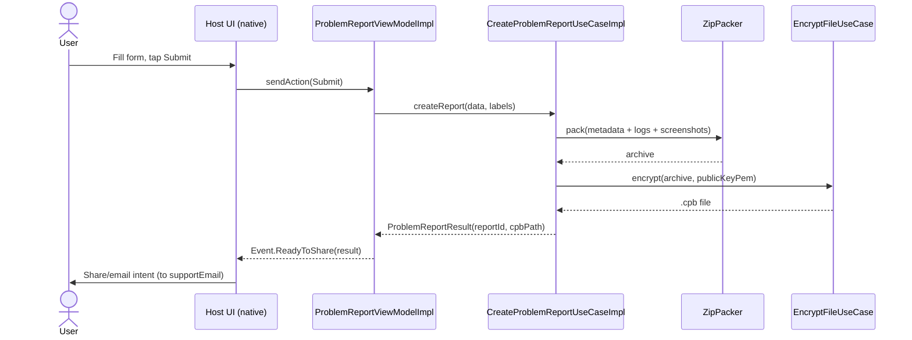

# Technical Design — Gears Mobile SDK


<!-- toc -->

- [1. Architecture Overview](#1-architecture-overview)
  - [1.1 Architectural Vision](#11-architectural-vision)
  - [1.2 Architecture Drivers](#12-architecture-drivers)
  - [1.3 Architecture Layers](#13-architecture-layers)
- [2. Principles & Constraints](#2-principles--constraints)
  - [2.1 Design Principles](#21-design-principles)
  - [2.2 Constraints](#22-constraints)
- [3. Technical Architecture](#3-technical-architecture)
  - [3.1 Domain Model](#31-domain-model)
  - [3.2 Component Model](#32-component-model)
  - [3.3 API Contracts](#33-api-contracts)
  - [3.4 Internal Dependencies](#34-internal-dependencies)
  - [3.5 External Dependencies](#35-external-dependencies)
  - [3.6 Interactions & Sequences](#36-interactions--sequences)
  - [3.7 Database schemas & tables](#37-database-schemas--tables)
  - [3.8 Deployment Topology](#38-deployment-topology)
- [4. Additional context](#4-additional-context)
- [5. Traceability](#5-traceability)

<!-- /toc -->

- [ ] `p3` - **ID**: `cpt-cyberfabricmobile-design-gears-sdk`

> Reconstructed from code via `cf-sdlc-reverse-engineer`. The problem-report FEATURE's
> flow / algo / state / dod IDs are traced to `@cpt-*` code markers (**FULL**; `cfs validate`
> coverage 6/6). DESIGN/PRD/ADR-level IDs (components, principles, decisions, requirements)
> stay docs-only; `file:line` evidence is cited below.
## 1. Architecture Overview

### 1.1 Architectural Vision

Gears Mobile is a **Kotlin Multiplatform (KMP) SDK** that ships shared feature behavior to
both Android and iOS from a single codebase, while each host keeps its native UI. Business
logic is written once in `commonMain`, compiled to an Android **AAR** and an iOS
**XCFramework** (via SKIE), with platform specifics isolated behind `expect`/`actual`.

The architecture is a **modular, layered "one gear per feature"** design. Each feature is a
set of modules split into four layers — `domain` (pure Kotlin contracts/entities), `data`
(implementations), `presentation:api` (the public MVI contract), and `presentation:impl`
(the ViewModel) — sitting on a shared common toolkit (DI, MVI base, logging, files, zip,
resources, crypto). Layer boundaries are enforced by Gradle **convention plugins**, not
convention alone, so the "clean path" is the only path a module can take.

The single public entry point is the `Gears` umbrella, which exposes feature ViewModels
through their MVI contracts. This keeps the SDK surface small and idiomatic on both
platforms (SKIE renders Kotlin `sealed`/`Flow`/`suspend` as native Swift).

### 1.2 Architecture Drivers

**ADRs**: `cpt-cyberfabricmobile-adr-kmp-shared-logic`, `cpt-cyberfabricmobile-adr-mvi-contract`, `cpt-cyberfabricmobile-adr-enforced-layers`

#### Functional Drivers

| Requirement | Design Response |
|-------------|------------------|
| `cpt-cyberfabricmobile-fr-report-a-problem` | Problem-report feature gear: form → package → encrypt → hand to host to share (`feature/problem-report`) |
| `cpt-cyberfabricmobile-fr-share-to-both-platforms` | One KMP codebase emits Android AAR + iOS XCFramework from the `gears` umbrella |

#### NFR Allocation

| NFR ID | NFR Summary | Allocated To | Design Response | Verification Approach |
|--------|-------------|--------------|-----------------|----------------------|
| `cpt-cyberfabricmobile-nfr-no-platform-drift` | Same behavior on iOS & Android | `commonMain` logic | Logic written once; only `expect`/`actual` differs | `commonTest` runs on JVM + iOS; `jvmTest` in CI |
| `cpt-cyberfabricmobile-nfr-report-confidentiality` | Reports must not be readable in transit | `:feature:problem-report:data` (`EncryptFileUseCase`) | Archive encrypted to a bundled RSA public key (`.cpb`) | `EncryptFileUseCaseImplTest` |
| `cpt-cyberfabricmobile-nfr-native-footprint` | No embedded VM / GC on iOS | Kotlin/Native | XCFramework is native; no JS/Dart runtime | `:gears:assembleGearsReleaseXCFramework` |

> Functional/NFR requirement IDs above are defined in the PRD ([PRD.md](../PRD/PRD.md)) and
> have been stakeholder-reviewed (2026-06-23).

### 1.3 Architecture Layers

- [ ] `p3` - **ID**: `cpt-cyberfabricmobile-tech-layering`

```
┌─────────────────────────────────────────────────────────────┐
│  Host app (native UI: SwiftUI/UIKit · Compose/Views)          │
└───────────────▲───────────────────────────────────────────────┘
                │ Gears.newProblemReportViewModel(Config)
┌───────────────┴───────────────────────────────────────────────┐
│  gears (umbrella)         → AAR + Gears.xcframework (SKIE)    │
├────────────────────────────────────────────────────────────────┤
│  presentation:impl  (ProblemReportViewModelImpl : MviViewModel)│
│  presentation:api   (ProblemReport: Action/UiState/Event/Config)│
│  data               (UseCase impls, Encrypt, DeviceInfo)        │
│  domain             (UseCase contracts, entities, ProblemType)  │
├────────────────────────────────────────────────────────────────┤
│  common toolkit: di · mvi · logging · files · zip · resources · │
│                  annotations · common                           │
└────────────────────────────────────────────────────────────────┘
```

| Layer | Responsibility | Technology |
|-------|---------------|------------|
| Presentation (api) | Public MVI contract: `Action`/`UiState`/`Event`/`Config` | Kotlin `sealed`/`data`, `:common:mvi` |
| Presentation (impl) | ViewModel behavior; unidirectional state | Coroutines, `BaseMviViewModelImpl` |
| Domain | Use-case contracts, entities, enums (no framework deps) | Pure Kotlin + `kotlinx.serialization` |
| Data | Use-case impls, encryption, device metadata | `cryptography-kotlin`, `:common:{zip,files}` |
| Infrastructure (common) | DI, logging, file system, archive, resources | `expect`/`actual` per platform |

Evidence: `gears/gears/build.gradle.kts`, `gears/settings.gradle.kts`, `gears/feature/problem-report/**`.

## 2. Principles & Constraints

### 2.1 Design Principles

#### Write business logic once, ship native on both platforms

- [ ] `p2` - **ID**: `cpt-cyberfabricmobile-principle-shared-logic-native-ui`

Feature behavior lives in `commonMain` and compiles to native artifacts for Android and
iOS. UI stays native per platform. Platform differences are contained to `expect`/`actual`
declarations (`FileSystem`, `DeviceInfo`, `ConsoleLogWriter`).

**ADRs**: `cpt-cyberfabricmobile-adr-kmp-shared-logic`

#### Enforced clean layering

- [ ] `p2` - **ID**: `cpt-cyberfabricmobile-principle-enforced-layers`

A module declares its layer by applying a convention plugin (`convention.module-domain`,
`-data`, `-presentation-api`, `-presentation-impl`, `-feature`); the plugin decides what it
may depend on. `domain` takes no UI/IO dependency.

**ADRs**: `cpt-cyberfabricmobile-adr-enforced-layers`

#### One UI contract: MVI

- [ ] `p2` - **ID**: `cpt-cyberfabricmobile-principle-mvi`

Every feature exposes a `sealed` `Action`/`UiState`/`Event` contract and a
`MviViewModel<Action, UiState, Event>`. Hosts dispatch actions, observe a `UiState` flow,
and react to one-shot events.

**ADRs**: `cpt-cyberfabricmobile-adr-mvi-contract`

### 2.2 Constraints

#### Android requires explicit context initialization

- [ ] `p2` - **ID**: `cpt-cyberfabricmobile-constraint-android-init`

On Android, the host **MUST** call `Gears.init(context)` once before creating a ViewModel,
so `ApplicationContextHolder` can resolve the app files directory. iOS needs no init.

Evidence: `gears/gears/src/androidMain/kotlin/app/constructor/gears/Gears.android.kt`,
`gears/common/files/src/androidMain/kotlin/app/constructor/csdk/files/FileSystem.android.kt`.

#### Build-gated quality floor

- [ ] `p2` - **ID**: `cpt-cyberfabricmobile-constraint-build-gates`

`allWarningsAsErrors = true`, plus ktlint (android_studio style) + custom ktlint rules +
detekt + sorted dependencies, all wired into the same gate as tests and CI.

Evidence: `gradle/plugins/.../convention/internal/internal.kotlin-base.gradle.kts`, `.editorconfig`, `.github/workflows/ci.yml`.

## 3. Technical Architecture

### 3.1 Domain Model

**Technology**: Kotlin data classes / enums + `kotlinx.serialization`

**Location**: [problem-report/domain](../../../gears/feature/problem-report/domain)

**Core Entities**:

| Entity | Description | Schema |
|--------|-------------|--------|
| `ProblemType` | Report category (Bug, UI, Performance, Account, Content, Other) | [ProblemType.kt](../../../gears/feature/problem-report/domain/src/commonMain/kotlin/app/constructor/csdk/problemreport/domain/ProblemType.kt) |
| `ProblemReportData` | Captured form input (type, description, repro steps, screenshots, includeLogs) | [ProblemReportData.kt](../../../gears/feature/problem-report/domain/src/commonMain/kotlin/app/constructor/csdk/problemreport/domain/entity/ProblemReportData.kt) |
| `ProblemReportResult` | Output: `reportId` + `cpbPath` of the encrypted archive | [ProblemReportResult.kt](../../../gears/feature/problem-report/domain/src/commonMain/kotlin/app/constructor/csdk/problemreport/domain/entity/ProblemReportResult.kt) |
| `DeviceMetadata` | OS/device info attached to the report | [DeviceMetadata.kt](../../../gears/feature/problem-report/domain/src/commonMain/kotlin/app/constructor/csdk/problemreport/domain/entity/DeviceMetadata.kt) |
| `MetadataLabels` | Localized metadata field labels | [MetadataLabels.kt](../../../gears/feature/problem-report/domain/src/commonMain/kotlin/app/constructor/csdk/problemreport/domain/entity/MetadataLabels.kt) |

**Relationships**:
- `ProblemReportData` → `ProblemType`: each report has one category.
- `CreateProblemReportUseCase(ProblemReportData, MetadataLabels)` → `ProblemReportResult`.

### 3.2 Component Model

#### `gears` umbrella

- [ ] `p2` - **ID**: `cpt-cyberfabricmobile-component-gears-umbrella`

##### Why this component exists
Single public entry point and the only module that produces the shippable artifacts (AAR + XCFramework).

##### Responsibility scope
Exposes `Gears.newProblemReportViewModel(Config)` (common) and `Gears.init(context)` (Android); aggregates feature gears; configures the iOS framework (SKIE, `baseName = "Gears"`).

##### Responsibility boundaries
Holds no feature logic; delegates to feature `*Module` DI factories.

##### Related components (by ID)
- `cpt-cyberfabricmobile-component-problem-report` — aggregates / exposes

Evidence: `gears/gears/build.gradle.kts`, `gears/gears/src/commonMain/kotlin/app/constructor/gears/Gears.kt`.

#### problem-report gear

- [ ] `p2` - **ID**: `cpt-cyberfabricmobile-component-problem-report`

##### Why this component exists
Lets a user report a problem; packages diagnostics into an encrypted archive the host shares by email.

##### Responsibility scope
Owns the report form state machine (MVI), report assembly (metadata + logs + screenshots → zip → encrypt), and the `.cpb` output.

##### Responsibility boundaries
Does **not** send the report; emits `Event.ReadyToShare` and lets the host present a share/email intent. Does not own UI.

##### Related components (by ID)
- `cpt-cyberfabricmobile-component-common-toolkit` — depends on (zip packing, app files dir, MVI base/contract)

#### common toolkit

- [ ] `p2` - **ID**: `cpt-cyberfabricmobile-component-common-toolkit`

`:common:mvi` (MVI base + `CSDKViewModel` Hilt bridge), `:common:logging` (leveled
logging, file/console writers), `:common:files` (`FileSystem` expect/actual), `:common:zip`
(`ZipPacker`), `:common:resources` (`StringProvider` over Compose-resources), `:common:di`
(`ApplicationContextHolder`/DI), `:common:annotations` (`@Immutable`), `:common:common`
(`runCatchingCancellable`).

### 3.3 API Contracts

- **Interface**: `cpt-cyberfabricmobile-interface-gears-public` (defined in [PRD §7.1](../PRD/PRD.md))
- **Technology**: Kotlin public API → Swift via SKIE; Android via AAR
- **Location**: [Gears.kt](../../../gears/gears/src/commonMain/kotlin/app/constructor/gears/Gears.kt)

**Public surface**:

| Symbol | Signature | Stability |
|--------|-----------|-----------|
| `Gears.newProblemReportViewModel` | `(ProblemReport.Config) → ProblemReport.ViewModel` | stable |
| `Gears.init` (Android only) | `(Context) → Unit` | stable |
| `ProblemReport.Config` | `(supportEmail: String, publicKeyPem: ByteArray, autoCapturedScreenshotPath: String?)` | stable |

> There are **no REST/HTTP endpoints** — the SDK is an on-device library. The "API" is the
> Kotlin/Swift public surface above.

### 3.4 Internal Dependencies

| Dependency Module | Interface Used | Purpose |
|-------------------|----------------|----------|
| `:feature:problem-report:presentation:api` | `api` | Public MVI contract re-exported by the feature/umbrella |
| `:common:mvi` | `api` (via presentation-api convention) | `MviViewModel`, `BaseMviViewModelImpl` |
| `:common:zip` | `implementation` | `ZipPacker` archive assembly |
| `:common:files` | `implementation` | `FileSystem` app-dir access |
| `:common:logging` | `implementation` | Diagnostics bundled into the report |
| `:common:di:app-module` | `implementation` | `ApplicationContextHolder` (Android) |

**Dependency Rules** (per convention plugins): no circular deps; `domain` imports no UI/IO; presentation-api exposes only the contract; layer is declared by the applied convention plugin.

### 3.5 External Dependencies

#### Cryptography (report encryption)

| Dependency | Interface Used | Purpose |
|-----------|----------------|---------|
| `cryptography-kotlin` (+ optimal provider) | Kotlin API | RSA-encrypt the report archive to a bundled public key (`.cpb`) |

#### Archive / IO

| Dependency | Interface Used | Purpose |
|-----------|----------------|---------|
| `kotlinx-io` / `kmp-zip` (iOS) | Kotlin API | Zip packing across platforms |

> No databases, no network services. The encrypted `.cpb` is handed to the host for sharing.

### 3.6 Interactions & Sequences

#### Create-and-share a problem report

**ID**: `cpt-cyberfabricmobile-seq-create-problem-report`

**Use cases**: `cpt-cyberfabricmobile-usecase-report-a-problem`



**Description**: The feature assembles diagnostics locally, encrypts them, and hands the
result to the host to share — the SDK never transmits data itself.

### 3.7 Database schemas & tables

**N/A** — the SDK persists no database. Transient artifacts are written to the app files
directory (`FileSystem.getAppDirectory()`) and cleaned up by the host.

### 3.8 Deployment Topology

- [ ] `p3` - **ID**: `cpt-cyberfabricmobile-topology-artifacts`

- **Android**: `./gradlew assembleAndroidMain` → `gears.aar` (+ per-module AARs), consumed via GitLab Maven publishing (`convention.gitlab-publishing`).
- **iOS**: `./gradlew :gears:assembleGearsReleaseXCFramework` → `Gears.xcframework` (device + simulator), `import Gears` in Swift.

## 4. Additional context

- CI (`.github/workflows/ci.yml`): SAST (Trivy/Semgrep/TruffleHog) + MobSF; Android build/test on Linux; iOS XCFramework build + native test on macOS.
- Known constraint: Compose-resources `getString()` can deadlock on the iOS simulator main thread → tests use a `TestStringProvider` fake; the generated `Res` package derives from `rootProject.name` (`Gears` → package `gears.*`).

## 5. Traceability

- **Methodology**: [reverse-engineering.md](../../../.cf-studio/.core/requirements/reverse-engineering.md)
- **Source markers**: problem-report flow/algo/state/dod IDs traced to `@cpt-*` markers in `gears/feature/problem-report/**` (see [FEATURE](../FEATURE/problem-report.md); `cfs validate` coverage 6/6)
- **Source evidence**: `gears/gears/**`, `gears/feature/problem-report/**`, `gears/common/**`, `gears/settings.gradle.kts`, `.github/workflows/ci.yml`
- **Features**: [FEATURE/problem-report.md](../FEATURE/problem-report.md)
- **PRD/ADRs**: [PRD.md](../PRD/PRD.md) (stakeholder-reviewed 2026-06-23), [ADR/](../ADR/)
